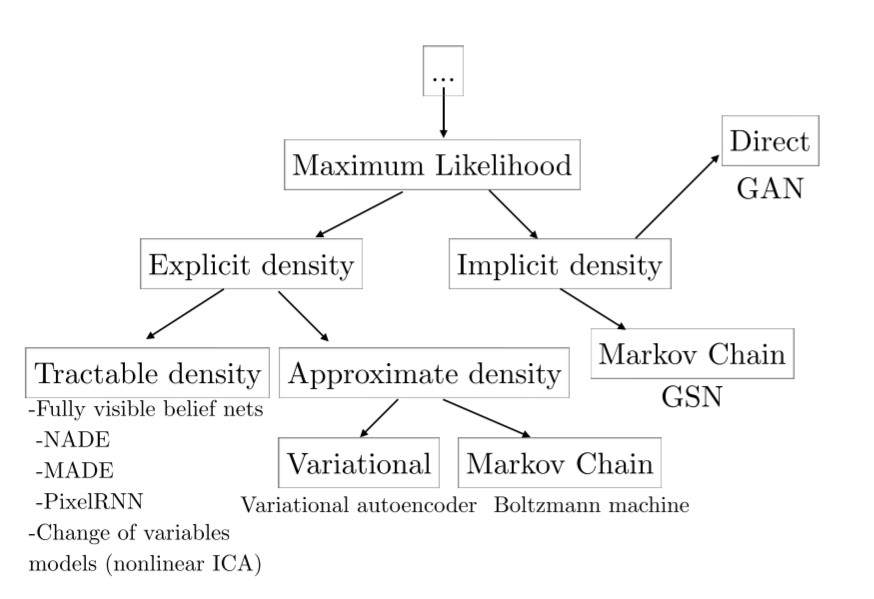

# NIPS 2016 Tutorial: Generative Adversarial Networks

[TOC]

## $\sect0$ Abstract

1. Why GAN is worth studying
2. How GANs work
3. Details of how GANs work
4. research frontiers
5. SOTA models that combine GANs with other methods

## $\sect1$ Why study generative modeling

1. To test ability to represent and manipulate high-dimensional. probability distributions.
2. To be incorporated into reinforcement learning:
   1. can be used to simulate possible futures
   2. enable learning in an imaginary environment
   3. guide exploration by keeping track of how often different states have been visited
   4. inverse RL
3. be used in semi-supervised learning.
4. works with multi-model outputs and derives different outputs which are acceptable.
5. helps in tasks in need of realistic generation of samples from some distribution:
   1. single image super-resolution
   2. create art
   3. image-to-image translation applications

## $\sect2$ How generative models work

### $\sect2.0$ Maximum likelihood estimation

It can also be seen as minimizing the KL divergence between data generating distribution & model: $\theta^\star={argmax}_\theta D_{KL}(p_{data}(x)||p_{model}(x,\theta))$.

### $\sect2.1$ Taxonomy of deep generative models

#### $\sect2.1.0$ Explicit density models

define an explicit density function $p_{model}(x;\theta)$. Then the maximization is straightforward, but it is hard to capture all of the complexity of data to be generated while still maintaining computational tractability. Needs careful construction or admits tractable approximations.

1. Tractable explicit models:
   1. Fully visible belief networks(FVBN): compute probability with chain rule: $p_{model}(x)=\prod^n_{i=1}p_{model}(x_i|x_1,...,x_{i-1})$. Samples must be generated one entry at a time and cannot be parallelized.
   2. Nonlinear independent components analysis: with a vector of latent variables $z$ and a differentiable, invertible transformation $g$ which can yield a sample from the model in $x$ space, we have $p_x(x)=p_z(g^{-1}(x))|det\big(\frac{\partial g^{-1}(x)}{\partial x}\big)|$, needs $g$ to be strictly restricted.
2. Explicit models requiring approximation:
   1. Variational approximations: define a lower bound: $ L(x, \theta)\leq(\log p_{model}(x, \theta)$, then maximize $L$. not unbiased.
   2. Markov chain approximations: is guaranteed to eventually converge, but it is too slow and can't be tested. high computational cost.

#### $\sect2.1.1$ Implicit density models

Some are based on drawing samples from $p_{model}$ to define a Markov chain. They fail to scale to high dimensional spaces and are computationally costly.

Finally it is GAN which is designed to avoid disadvantages mentioned above:

- generate in parallel (versus FVBNs)
- few restrictions with generator function (versus nonlinear ICA and Boltzmann machines)
- no Markov chain
- no variational bound
- produce better samples

## $\sect3$ How GANs work

set up a game between generator and discriminator. 

The generator is a differentiable function G. Its inputs don't need to correspond to the first layer of the network. We can apply additive or multiplicative noise to hidden layers or concatenate noise to hidden layers of the network.

Train with simutaneous SGD.

Cost functions:

The discriminator has only one type of cost functions, while there is a variety of cost functions on the generator.

- $J(D)$: cross entropy cost

  $J^{(D)}(\theta^{(D)},\theta^{(G)})=-\frac{1}{2}\mathbb E_{x\sim p_{data}}\log D(x)-\frac{1}{2}\mathbb E_z\log (1-D(G(z)))$ 

  By training the discriminator, we obtain a estimate of the ratio $\frac{p_{data}(x)}{p_{model}(x)}$.

- Minimax: Assuming the game is a zero-sum game, namely $J^{(G)}=J^{D}$, then we define value function $V(\theta^{(D)}, \theta^{(G)})=-J^{(D)}(\theta^{(D)}, \theta^{(G)})$. We calculate $\theta^{(G)\star}=argmin_{\theta^{(G)}}max_{\theta^{(D)}}V(\theta^{(D)}, \theta^{(G)})$. Zero-sum games are also called minimax games.

- Heuristic, non-saturating game: $J^{(G)}=-\frac{1}{2}\mathbb E_z\log D(G(Z))$. Heuristically motivated rather than motivated by a theoretical concern, can't be  described with a single value function.
- Maximum likelihood game:  $J^{(G)}=-\frac{1}{2}\mathbb E_z \exp\big(\sigma^{-1}(D(G(z)))\big)$.

The generator can be thought of as learning by a strange kind of reinforcement learning, but it can observe the gradients of the reward and the reward is non-stationary. $J^{(G)}$ doesn't make reference to the training data directly, which makes GANs resistant to overfitting.   

DCGAN: 

- Use BN
- Use all-conv net
- Use Adam
- demonstrate that GANs can learn  a distributed representation.

## $\sect4$ Tips and tricks

- Train with labels
- encourage the discriminator to estimate soft probabilities by using one-sided label smoothing: set data labeled as 0.9 while generator's output labeled as 0.
- Since BN results in fluctuation of the normalizing constants which has more effect on the image generated by the GAN than the input, we introduce reference batch normalization which causes overfit to the reference batch. Then we use **virtual batch normalization**

## $\sect5$ Research frontier

### $\sect5.0$ Non-convergence

mode collapse (Helvetica scenario): generator makes multiple images that contain the same color or texture themes. It happens since minimax turns to be maximin. StackGAN, UnrolledGAN. 

### $\sect5.1$ Evaluation of generative models

### $\sect5.2$ Discrete outputs

- use reinforce algorithm
- use concrete distribution or Gumbel-softmax
- decode continuous values to discrete ones

### $\sect5.3$ Semi-supervised learning

CatGAN, feature matching GAN.

### $\sect5.4$ Reinforcement learning

### $\sect5.5$ Using the code

