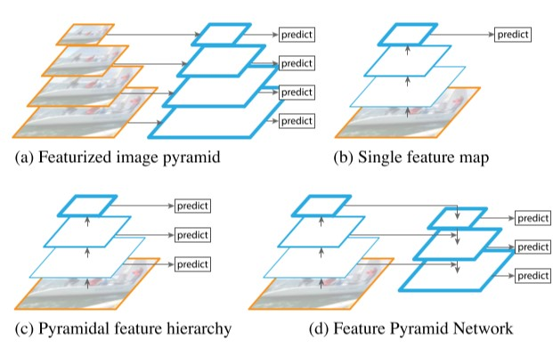
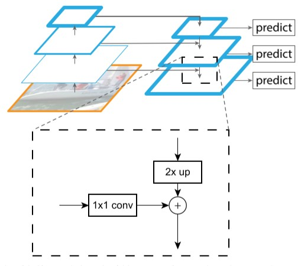

FPN 笔记

## 一、背景

目标检测中需要对不同尺寸的物体进行检测，为了满足这一需求，在经典的方法中常常使用图像金字塔上建立的特征金字塔，通过在图像的不同放缩下分别获取特征并进行预测，如图（a）。进入深度卷积神经网络时代，由于CNN的缩放不变性，使用单个放缩尺度也可以获得较好的结果，如图（b）。但进一步提升性能也需要多个尺度的信息，但这样大幅提升内存和时间的消耗。考虑到CNN本身的每一个层本身提供了不同尺度层级的特征信息，而CNN中的降采样又自然地使不同层级获得不同层次的信息，所以CNN天然可以提供多层级的金字塔型的特征。但随着层级的提升，该层级的特征信息的语义更加强而空间分辨率降低，如果直接对CNN不同层级的输出进行使用，如图（c）在表示能力上依旧有所欠缺。因此使用CNN不同层级的信息结合来增强表示能力需要对模型结构作进一步改进，使每一层都兼顾语义和空间分辨率。改进得到的FPN结构如图（d）。

## 二、FPN

FPN的目标在于充分利用CNN的固有的特征金字塔结构，以及从低层到高层的语义，使得每一个层都具备高语义。CNN对于任意尺寸的图像输入，获取成比例大小的一系列特征图，则FPN的流程概括如下：

1. 自底向上的通路：通过CNN自下向上生成一系列收缩比为2的特征序列，对于同一级网络输出的相同大小的特征图取其中的最后一层；

2. 自顶向下的通路和隐连接：由于高层特征语义强而空间分辨率低，低层相反，所以可以通过不同级之间的组合增强语义。在自顶向下的过程中，将本级的特征通过一个1\*1的卷积，上一层的特征进行一次\*2的上采样，再对两者取和作为输出。这个过程可以理解为对本层的较好空间定位能力与上层较好语义表示能力进行加权综合，确保同时具有高语义和高空间定位能力。

   

## 三、应用

将FPN应用于RPN：将RPN的单个输入替换为一个特征图列表，分别进行anchor的计算。由于FPN提供了不同的空间尺度，设置anchor时不需要在单个特征图上建立多个尺寸的anchor而只需改变anchor的高宽比。因此，anchor数由不使用FPN的Faster RCNN中的高宽比设置数乘尺寸设置数改为高宽比设置数乘FPN提供特征图数，anchor数目并未增加而不同尺度的表达能力增加。

将FPN应用于Fast RCNN：假设某个RoI的大小为$w\times h$，整张图片的大小为$a\times a$，若长宽为a的框对应到FPN的第$k_0$级输出，则以上RoI对应到第k级输出，其中$k=\lfloor k_0+\log_{2}{\frac{\sqrt{wh}}{a}}\rfloor$。各级FPN生成的RoI会通过RoI池化变为同一尺寸，根据上式就可以进行原图尺寸的反推。最后的分类和框回归之前的网络部分使用两层的全连接层。

## 四、实验结论

1. 直接对各层特征加以利用而没有自顶向下的连接效果不如有自顶向下连接，说明各层之间的语义差距确实影响表示能力。
2. 通过隐式连接确保了更好的定位能力提升准确率。
3. 建立金字塔结构可以提升准确率。

