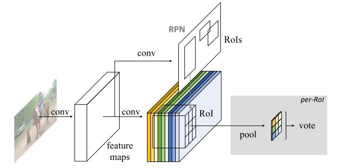
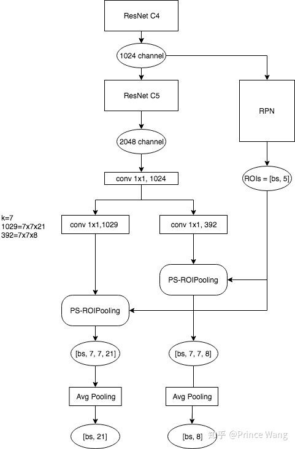

# R-FCN笔记

## 一、背景

过去的多级目标检测被RoI池化分为两个子网络：一个RoI池化独立的池化前的全卷积网络和一个逐个RoI计算而无法共享计算的子网络。这种设计是分类模型卷积+池化+全连接的思路的历史遗留。

随着ResNet、Inception等全卷积模型的使用，自然地想要使用全卷积的目标检测方法，但其实验效果较差。原因在于分类模型要求模型当图片发生变换（平移、旋转等）依旧输出相同结果，而目标检测恰恰相反，需要图片变换时输出的检测框作出对应的变换。这种变换不变性与变换可变性之间存在矛盾。而对于卷积神经网络，网络层数越高，对于空间信息的保留也越差，所以Faster RCNN等模型将卷积神经网络通过RoI池化分为两个子阶段，确保空间信息可以得到保留，但也随之引入每个区域内的大量计算，降低了模型的效率。

为了使用全卷积神经网络完成目标检测，引入使用特定卷积层的位置敏感得分图和结合位置信息的位置敏感RoI池化。模型中所有可学习参数均为卷积参数且被共享。

## 二、R-FCN（Region-based Fully Convolutional Network）

### 总述

本模型依旧沿用两级目标检测方法，使用RPN（全卷积）进行预选区域提取。其后是R-FCN结构，它输出$k^2(C+1)$个通道输出，其中$k^2$对应这么多个空间方向关系的描述，C为类别数，由于背景的存在需要加一。 对于每一个RoI，结合R-FCN进行池化，此后输出各个类别的得分。总体结构如下图：

逻辑框图如下（来自知乎）：

### Backbone

ResNet-101:100层卷积+全局平均池化+1000类全连接。这里使用卷积部分，并使用$1\times1$卷积将输出通道数调整为1024。

### 位置敏感分数图和位置敏感 RoI 池化

R-FCN位置敏感分数图中的每一个通道对应一个特征图，$k^2$个通道组成一组表示一个类别，一组中的每一个特征图表示特征图上的一种位置关系。例如如果k取3，则9种关系可以表示正上方，左上方，右上方，正中间，左边，右边，正下方，左下方，右下方。这样，根据RPN产生的RoI信息（x, y, h, w），使用x和y可以在分数图中确定一个锚点，根据w，h确定放缩比为$\frac{w}{k},\space \frac{h}{k}$，接下来按照以上参数进行RoI池化获得$(k,k,k^2(C+1))$的特征图再进一步在通道上进行平均池化得到$(k,k,C+1)$的特征图，每一个分量对应这个RoI候选框每个子块属于各类物体一部分的概率。接下来进一步池化为一个（C+1）维向量进行softmax即可完成分类。

边界框回归与上述过程类似，但是产生了$4k^2$个通道。最终池化为4个输出。

## 三、训练

使用多任务损失，与Faster RCNN相同。由于池化计算几乎可以忽略，每个RoI的单独计算几乎没有时间消耗。

